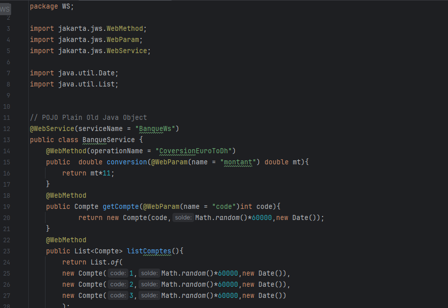
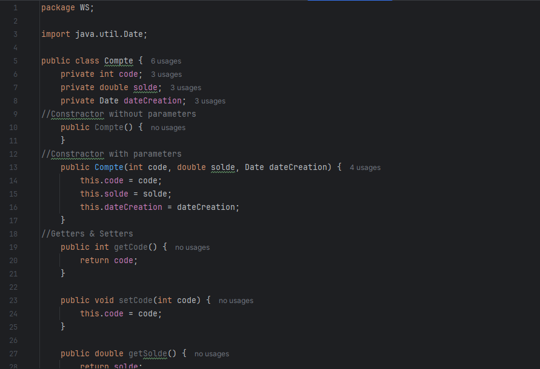
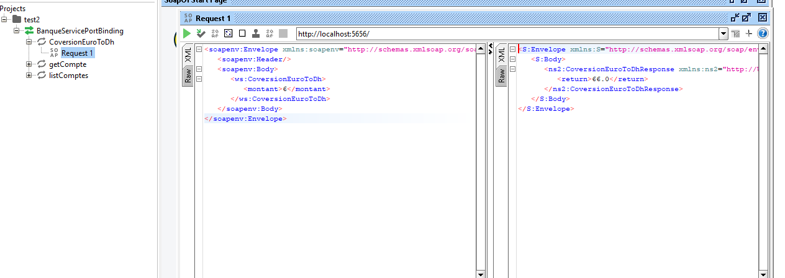
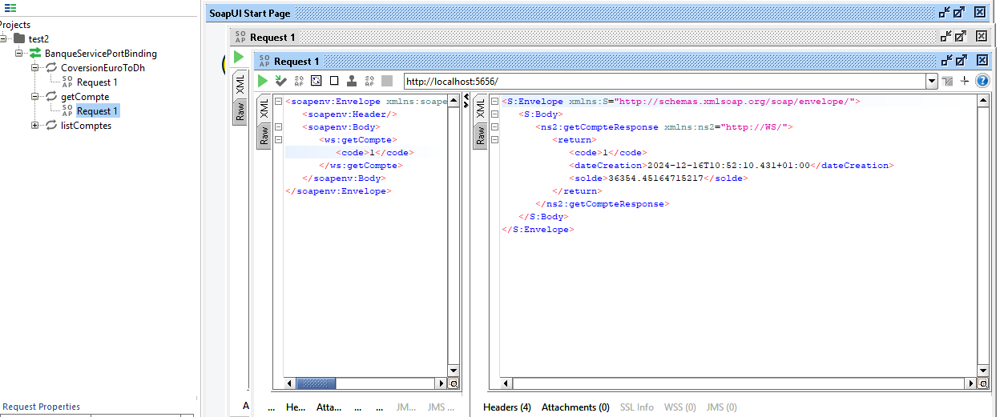
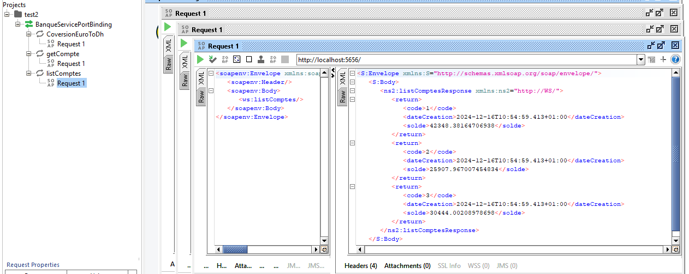
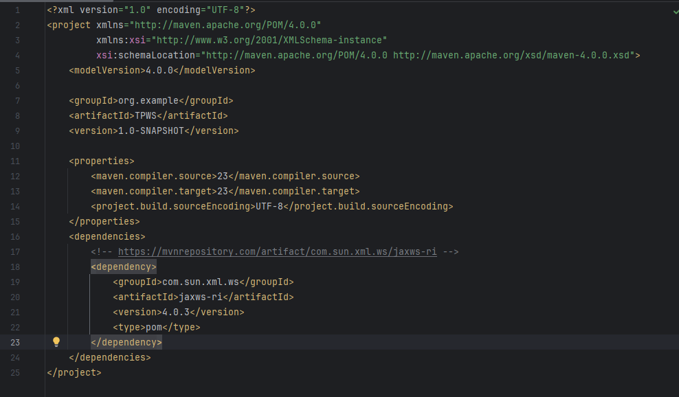
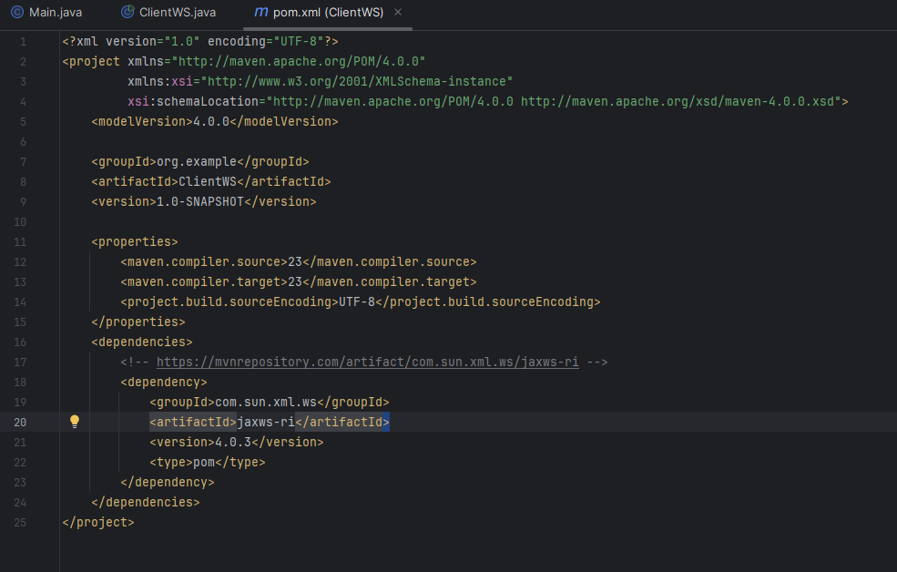
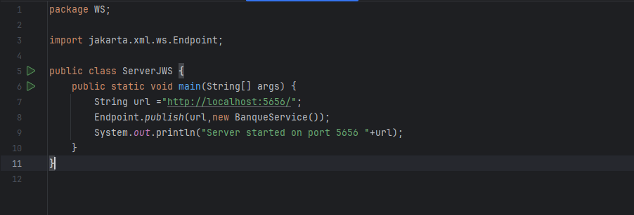
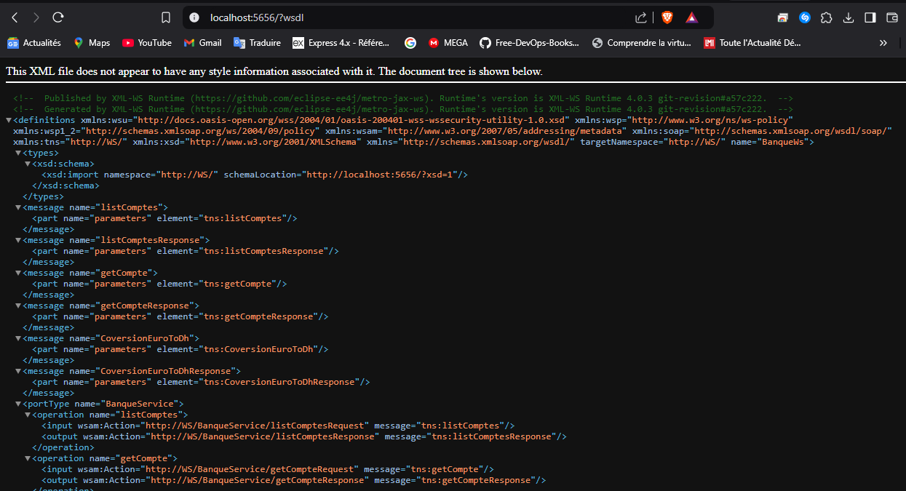

<h3>Banque Service</h3>

<h3>Client Web Service</h3>
<<<<<<< HEAD

=======

>>>>>>> 3f8ff15e6c61c3127e202c2abbabaac58ee357cc

<h3>Compte</h3>

<h3>Conversion Method Test with SOAP</h3>

<h3>Conversion Method Test with SOAP (Duplicate)</h3>

<h3>Get Compte Test with SoapUI</h3>

<h3>Liste Comptes Test with SoapUI</h3>

<h3>POM</h3>

<h3>POM (ClientWS)</h3>

<h3>Server Web Service</h3>

<h3>WSDL</h3>

